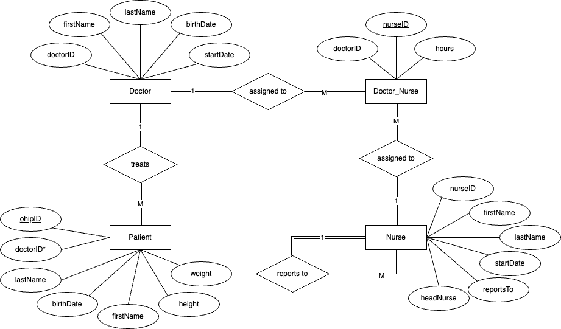

# Hospital Management SQL Project
### CS319 - Databases

This project is a sample hospital management database built using SQL.  
It models relationships between doctors, nurses, patients, and work assignments.  
The database includes tables for each entity, sample data, and queries that demonstrate updates, inserts, deletes, views, and various data retrieval operations.  

## What I Did
- Designed the database schema and created tables for doctors, patients, nurses, and work assignments.
- Populated the database with sample data.
- Wrote and executed SQL queries to update, insert, delete, and retrieve information.
- Created a view to summarize doctor-patient relationships.
- Ran advanced queries to analyze relationships and constraints within the database.

## ER Diagram

